1. Creamos una carpeta de trabajo con:
    - Dos carpetas (**Ordenador1** y **Ordenador2**), que simularán dos equipos remotos.
    - Este README.md para ir editándolo y creando el registro de trabajo con capturas.
    - Una carpeta "img" para las imágenes que serán referenciadas desde el README 	
	
     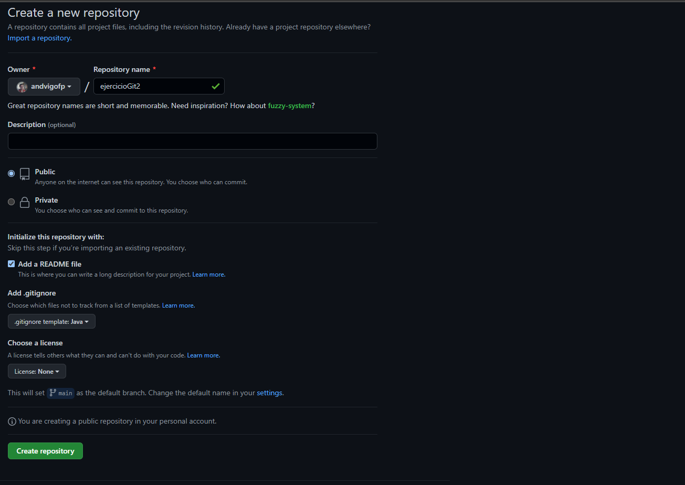
	
2. Creamos un repositorio vacío (sin README ni gitignore) en GitHub.
	
    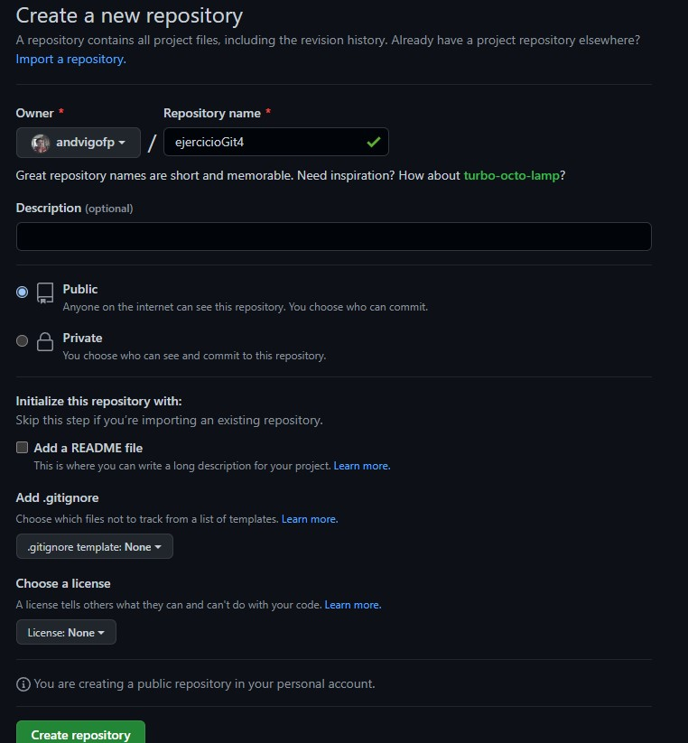
	
3. Creamos un proyecto de IntelliJ en **Ordenador1** con repositorio de Git y código de ejemplo.
	
    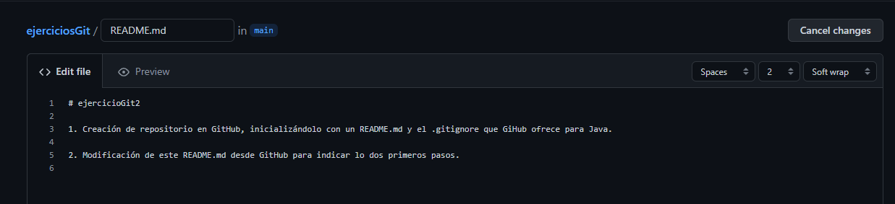
	
	
	
4. Creamos un nuevo README.md localmente (no el presente con el registro de trabajo, que se añadirá al final sustituyendo a ese.)
   
   - Creamos el **README.md** desde el proyecto en intellinj
	
   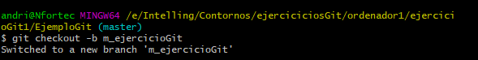
	
5. Realizamos un primer commit y push de la base del proyecto.
	 	
   - Primer commit **proyecto base con hola mundo**
	
    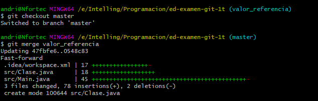
	
    ```bash
    git status
    git add .
    git commit -m "proyecto base hola mundo"
    ```
	
 - Una vez que realizamos el **commit lo puseamos a nuestro repositorio remoto**
	  
    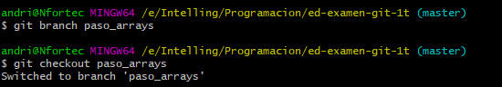
		
     ```bash
     git remote add origin https://github.com/andvigofp/ejerciciosGit.git
     git push -u origin master
     ```
	
6. Clonamos el proyecto dentro de **Ordenador2** y lo abrimos.
	
    
	
    ```bash
    git clone https://github.com/andvigofp/ejerciciosGit.git
    ```
	
7. Creamos una nueva funcionalidad, para lo cual creamos una rama "feat_persona" y la desarrollamos (ver mi log de commits). Una vez lista subimos la rama (```git push feat_persona```). Después, nos movemos a master para hacer un merge de "feat_persona" **localmente**. Al no haber nuevos commits en master, el merge debería ser automático y sin conflictos. Después del merge, hacemos un push de master con los nuevos cambios añadidos.	
	
   1. Primer paso: 
   
   - creamos la rama "feat_persona"
	
   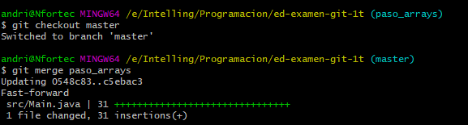
	
    ```bash
    git branch feat_persona o git checkout -b feat_persona:  "te lo crea y cambia directamente a la rama "feat_persona""
    git checkout feat_persona - cambia de rama "feat_persona"
    ```
	
    2. Segundo paso
    
    - Creamos el objeto **Persona.java** y editamos **Main.java**, lo ejecutamos
    - Segundo commit **probando un objeto Persona**	
	
     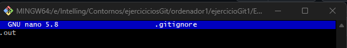
	
     ```bash
     git status
     git add .
     git commit -m "probando un objeto Persona"
     ```
	
    - Nos queda subir la rama feat_persona
    
    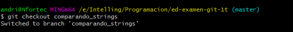
		
    ```bash
    git push --set-upstream origin feat_persona o git push -u origin feat_persona
    ```
	
    3. Tercer paso
    
    - Nos cambiamos a la rama **master**, hacemos un **merge** 
	  
     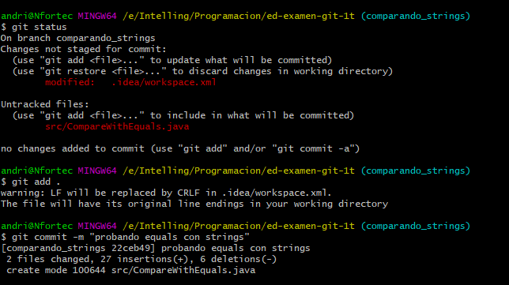
		
     ```bash
     git checkout master
     git merge feat_persona
     ```
	
    - Ahora nos queda hacer un push, para subirlo a remoto
	 
     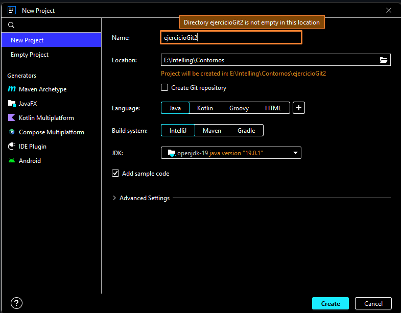

     ```bash
    git push
    ```
	
8. Volvemos a **Ordenador1**. Recordamos el estado de nuestro proyecto en este ordenador haciendo un ```git status``` y un ```git log```. Si no nos indica que el master local está por detrás del remoto (origin/master), será necesario hacer un ```git fetch```.
	
  1. primer paso
  
  - Nos volvemos al directorio ordenador1
	
   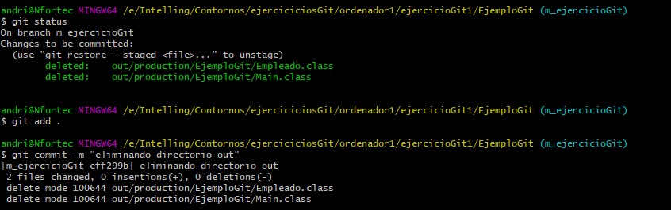
	
    ```bash
    git status
    git log - para ver los commits en la rama correspondiente
    git fetch - Para comprobar los cambios echos
    ```
	
9. Para poder seguir trabajando desde **Ordenador1**, deberíamos hacer antes de nada un pull para traernos el nuevo commit que tiene master en remoto. Sin embargo, vamos a probar qué sucedería si nos olvidamos de ello.
 
 - Este paso no lo saltamos
	 	
   ```bash
   git pull - Nos descarga los cambios mas rencientes de remoto a local
   ```
	
10. Desarrollamos una nueva funcionalidad "feat_empleado" en su correspondiente rama.
	
  1. Primer paso
	
   - Creamos la rama **feat_empleado** y nos cambiamos a rama **feat_empleado**
	
   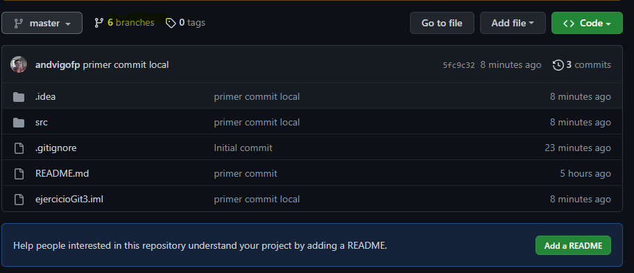
	
   ```bash
   git branch feat_empleado o git checkout -b feat_empleado
   git checkout feat_empleado 
   ```
	
1. Durante el desarrollo, antes de hacer el primer commit en feat_empleado, detectamos que el fichero .idea/workspace.xml cambia automáticamente a menudo al abrir el proyecto en IntelliJ (es un archivo de metadatos de proyecto de IntelliJ).
	
 2. Segundo paso
  
 - Editamos .gitignore y añadimos .idea/workspace - para que suba en remoto los cambios echos por cada cambio que hagamos
		
 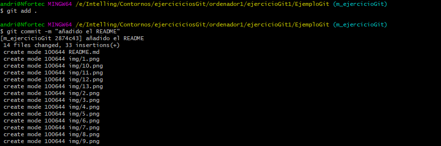
		
	
2. Hacemos un primer commit para añadir ```.idea/workspace.xml``` al .gitignore. Además, como los ficheros de ese directorio ya se han añadido previamente al repositorio, tendremos que eliminarlos de él haciendo:
		
 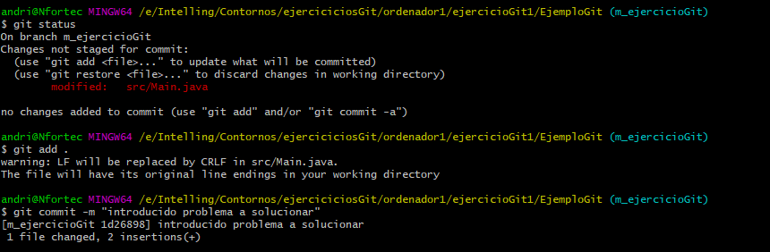
		
  ```bash
  git rm --cached .idea/workspace.xml
  ```
	
 3. Tercer paso

- Nos queda añadir el commit **añadido workspace.xml a gitignore**
	
  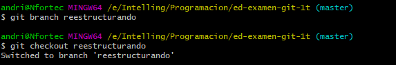
		
  ```bash
  git status
  git add .
  git commit -m "añadido workspace.xml a gitignore"
  ```
	
  3. Hacemos los otros 2 commits y pusheamos.
	
   3. Tercer paso
   
   - Creamos el objeto **Empleado.java** y editar el **Main.java**
   - Nos queda añadir el commit **probando objeto empleado**
	
   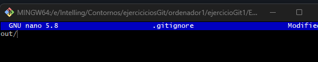

   ```bash
   git status
   git add .
   git commit -m "probando objeto empleado"
   ```
	
  - Volvemos a Editar **Empleado.java** y **Main.java**
  - Nos queda añadir el commit **encapsulando toString de Empleado**
	
  
		
   ```bash
   git status
   git add .
   git commit -m "encapsulando toString de Empleado"
   ```
		
  - Último nos queda subir la rama correspondiente **feat_empleado**
	 
   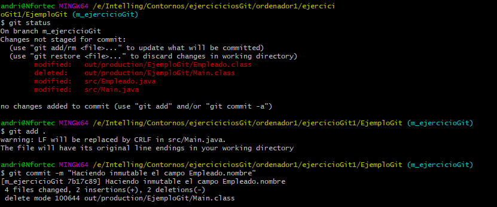
		
   ```bash
   git push --set-upstream origin feat_empleado o git push -u origin feat_empleado
   ```
		
   4. Vemos todas las ramas que tenemos.
	
    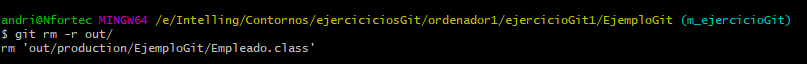

    ```bash
    git branch -a
    ```

 feat_persona solo debería estar en remoto, ya que es una rama que no se ha usado en este "ordenador".

5. Hacemos un checkout a master para mergear. Al hacer el push detectamos que hay un conflicto. Hemos olvidado de descargarnos los cambios que habíamos hecho en el   otro ordenador y que tenemos subidos a GitHub.
		
- Nos cambiamos a la rama master y hacemos un push "Nos da error porque no hicimos un pull para descargar los cambios en remoto a local, ahora tenemos conflicto con los nuevos cambios"

   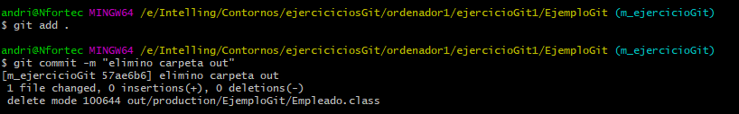
		
   ```bash
   git checkout master
   git push
   ```
		
6. Podríamos hacer un pull, que implicaría un merge de la rama remota a la rama local, como ya hemos visto, pero para hacerlo bien, vamos a eliminar los nuevos commits de master (siguen en feat_empleado, así que no se pierden). Para ello, usamos un ```git reset --hard``` desde master, volviendo al último commit común al master remoto.
  
  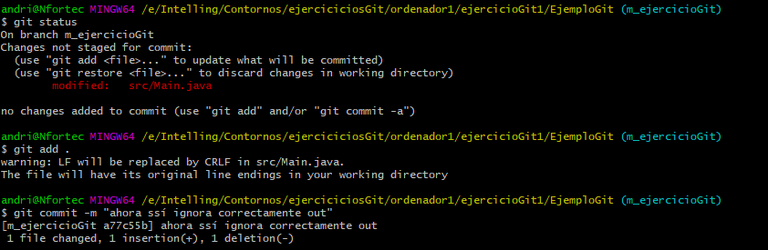
		
   ```bash
   git reset --hard
   ```

  7. Ahora sí podemos hacer un pull de master sin conflicto.
    
   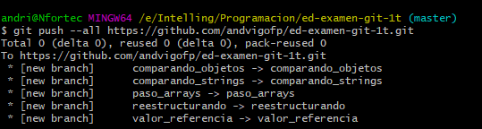
	
   ```bash
   git pull
   ```
   
 8. Hacemos merge de la nueva rama local feat_empleado. Ahora sí tendremos conflicto.

  

Solventamos los conflictos (en Main.java) y como realmente se está abordando la misma funcionalidad, lo llevamos más allá y dejamos una versión funcional con lo que queremos quedarnos de cada rama (ver en mi log).
		
- Nos da conflicto en Main.java, con los cambios de remoto en local, lo tenemos que solventar
			
  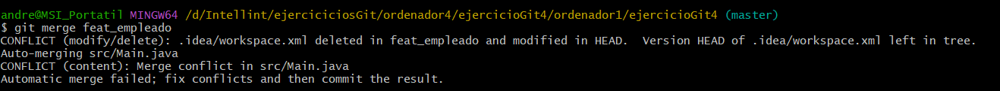
		
   ```bash
   git merge feat_empleado
   ```
		
 9. Terminamos el merge con add y commit, y hacemos un push.
		
    - Editamos el Main.java y solventamos los confictos, añadimos el commit **Merge remote-tracking branch 'origin/feat_empleado'** y lo psueamos 
    
    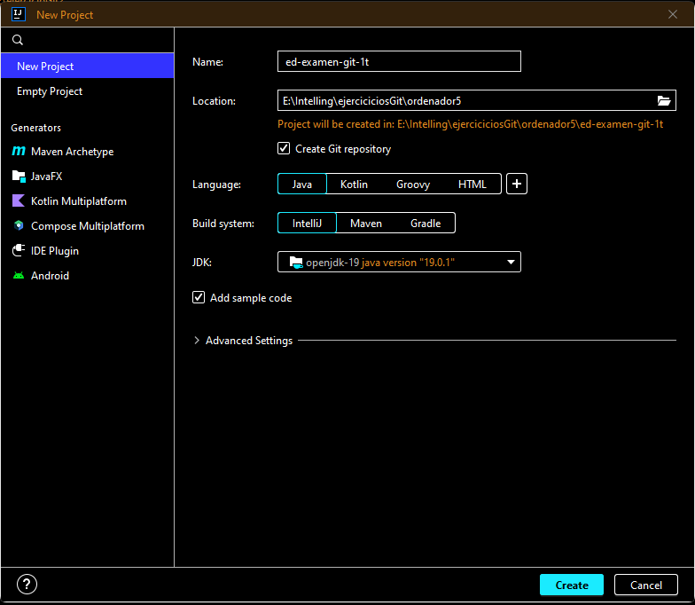
		
    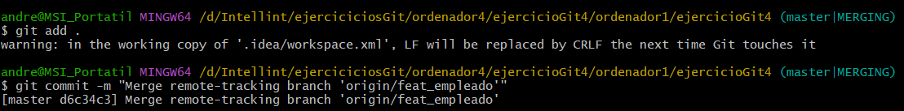
		
    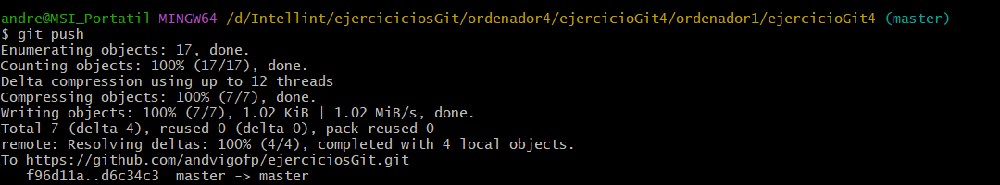
		
    ```bash
    git status
    git add .
    git commit -m "Merge remote-tracking branch 'origin/feat_empleado'"
    git push
    ```
   
11. Volvemos a Ordenador2 y comprobamos si tenemos todo al día con ```git status``` y ```git log```. Si no nos indica que el master local está por detrás del remoto, será necesario hacer un ```git fetch```, que ahora nos indicará que debemos hacer un pull.

 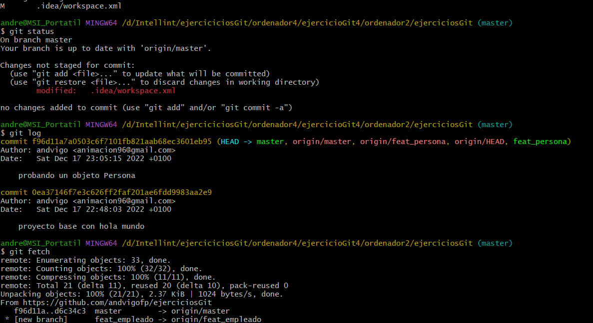
			
   ```bash
   git status
   git log
   git fetch
  ```

- Conprobamos que hay un conflicto al intentar hacer un **git pull**, para descargar los cambios de remoto a local
 
 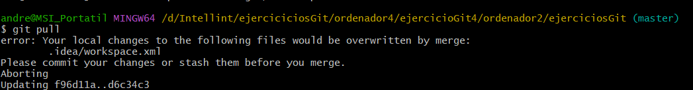
		
  ```bash
  git pull
  ```
 - Lo soluciomar hacer un **git reset --hard** "Vuelve a ultimo commit"
		
   
		
  ```bash
 git reset --hard
 ```
		
- Ahora si nos deja hacer **git pull**
  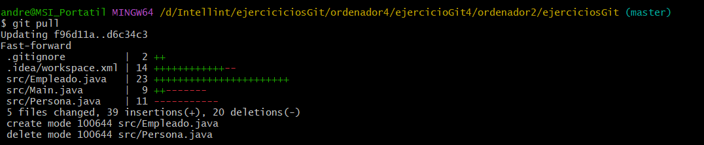
  
 ```bash
 git reset --hard
  ```
		
12. Ahora vamos a simular cómo se desarrollaría en paralelo en varias ramas (distintas personas). No crearemos carpetas que simulen ordenadores pero cada rama representará el trabajo independiente de cada componente del equipo de trabajo.

 1. Creamos dos ramas desde master, que desarrollaremos sin hacer merge a master (simulando otro desarrollador trabajando en paralelo): 
		
  1. Primer paso 
   
   - crear las dos ramas **feat_inmutable_fields** y **bug_edad_negativa**
    
   
				
  ```bash
  git branch feat_inmutable_fields o git checkout -b feat_inmutable_fields
  git branch bug_edad_negativa o git checkout -b bug_edad_negativa
  ```
       
1. "feat_inmutable_fields" para evitar que se pueda cambiar el nombre y la fecha de contratación de un empleado (asumimos que las especificaciones del proyecto lo impiden, sea o no razonable).
		
  2. Segundo paso
  
  - Cambiar de rama **feat_inmutable_fields**
		
  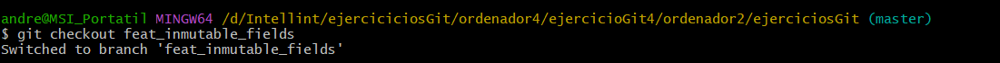
		
   ```bash
   git checkout feat_inmutable_fields
   ```
		
  3. Tercer paso
  
  - Ahora editamos Main.java "para evitar cambiar la fecha"
  - Añadimos el commit **diseñamos las pruebas de esta funcionalidad**
   
   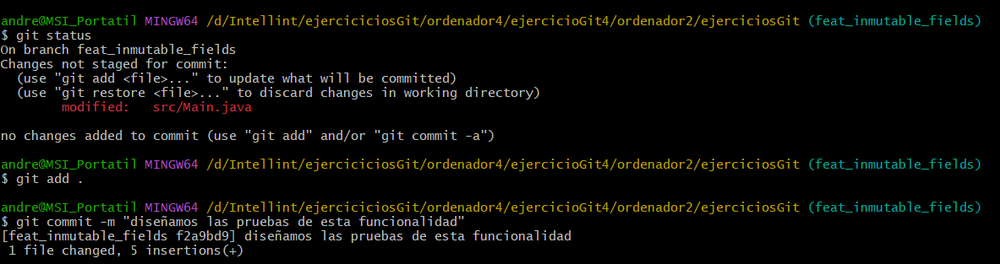
		
   ```bash
   git status
   git add .
   git commit "diseñamos las pruebas de esta funcionalidad"
   ```
		
  4. Cuarto paso
   
   - Editamos **Empleao.java** y **Main.java**
   - Añadimos el commit **ahora hay dos campos inmutables**
   
   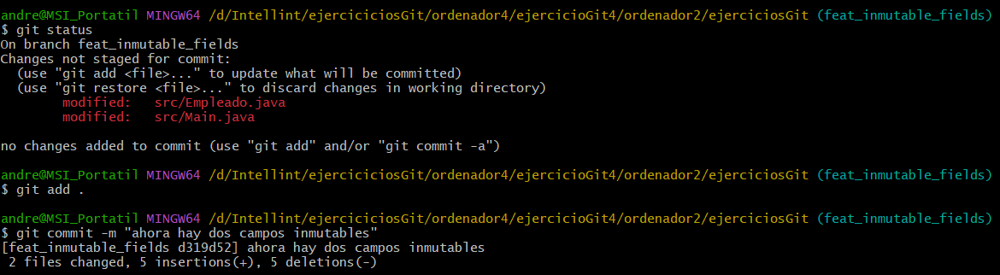
		
   ```bash
   git status
   git add .
   git commit "ahora hay dos campos inmutables"
   ```
		
   - Lo ultmo nos queda subir la rama correspondiente a remoto
     
   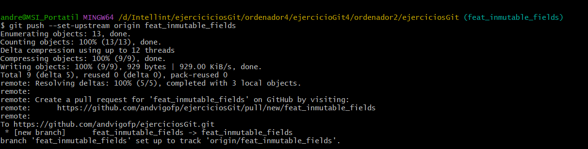
			
   ```bash
   git commit "push --set-upstream origin feat_inmutable_fields o git push -u origin feat_inmutable_fields"
   ```
     
  2. "bug_edad_negativa", para garantizar que la edad de un empleado no pueda ser negativa.
		
   1. Primer paso
   
   - nos cambiamos a la **bug_edad_negativa**
	 
   
			
  ```bash
  git checkout bug_edad_negativa
  ```
	

   2. Segundo paso
  
  - Editamos **Main.java** "para mostar una prueba de error" y lo comiteamos **diseñamos la prueba que muestra el error**
    
   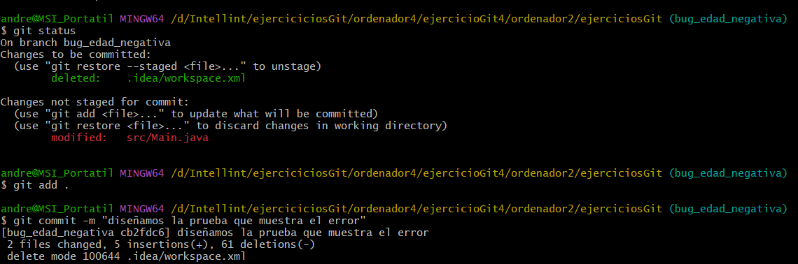
			
   ```bash
   git status
   git add .
   git commit -m "diseñamos la prueba que muestra el error"
   ```
      
   3. Tercer paso
   
   - Editamos **Main.java** y **Empleado.java** lo commiteamos **information hidding: edad es solo modificable a través de un setter** 
    
   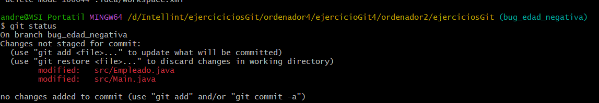
				
   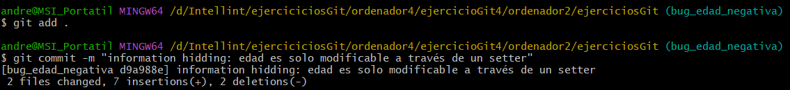
				
   ```bash
   git status
   git add .
   git commit -m "information hidding: edad es solo modificable a través de un setter"
   ```
				
  4. Cuarto paso
  
  - Editamos **Main.java** y **Empleado.java** lo commiteamos **reuelto**
   
   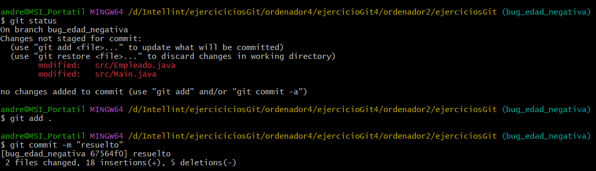
					
   ```bash
   git status
   git add .
   git commit -m "resuelto"
   ```
				
 - Último lo puseamos para subirlo a remoto
  
  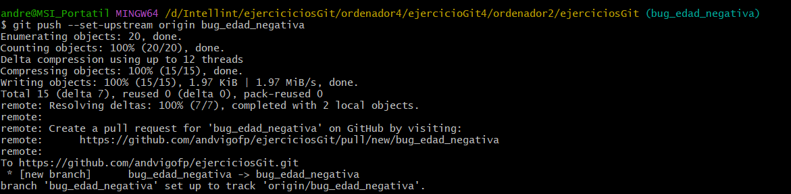
				
 ```bash
 git push --set-upstream origin bug_edad_negativa
 ```
 
3. Una vez desarrolladas, hacemos el merge de ambas ramas a master solventando conflictos.
		
 1. Primer paso
 
 - Nos cambiamos a la rama master
 - Hacemos un merge **feat_inmutable_fields**
 - Último lo puseamos 
	
 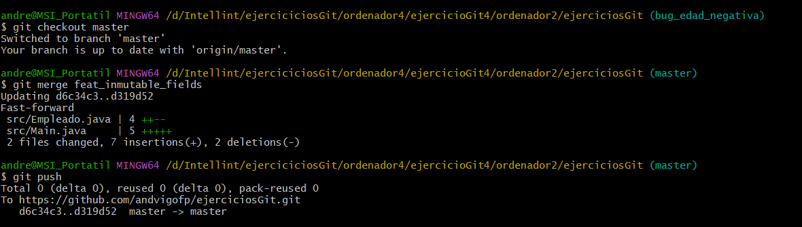
			
  ```bash
 git checkout master
 git merge feat_inmutable_fields
 git push
 ```
 
 2. Segundo paso
 
 - Hacemos un merge **bug_edad_negativa**
  
  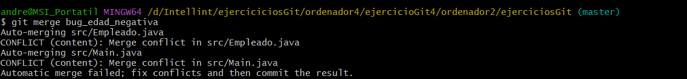
				
  ```bash
 git merge bug_edad_negativa
 ```
 3. Tercer paso
 
 - Comprobamos que tenemos un conficto al hacer merge, nos toca solucionarlo
 - Editamos **Main.java** y **Empleado.java**, lo comiteamos **Merge branch 'bug_edad_negativa'**, estaría solucionado el problema
  
  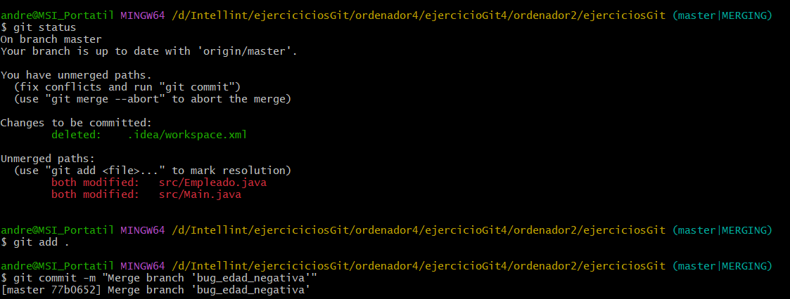
				
   ```bash
   git status
   git add .
   git commit -m "Merge branch 'bug_edad_negativa'"
   ```
				
 - Último lo puseamos para subirlo a remoto
   
  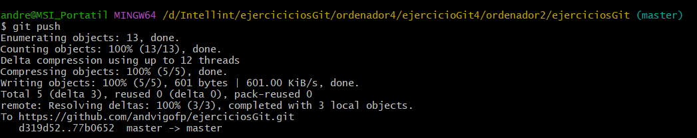
   
   ```bash
   git push
   ```
				
13. Realizamos otras mejoras en la rama feat_pojo para **mostar el problema**, **los campos son privados y se accede mediante getters**, y los mergeamos.
	
 1. Primer paso
 
 - Creamos la rama **feat_pojo** y nos cambiamos a esta rama
  
  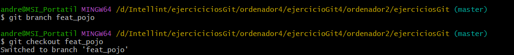
 
  ```bash
  git branch feat_pojo o git checkout -b feat_pojo
  git checkout feat_pojo
  ```
   	
  2. Segundo paso
	
  - Modificamos **Main.java** y **Empleado.java**, para mostar el problema
  - Lo comiteamos **mostrando el problema**
  
  
		
  ```bash
  git status
  git add .
  git commit -m "mostrando el problema"
  ```
  
 3. Tercer Paso
 
 - Modificamos **Main.java** y **Empleado.Java**, los campos ahora son privados y se acceden mediante getters
 - Lo comiteamos **los campos son privados y se accede mediante getters**
  
   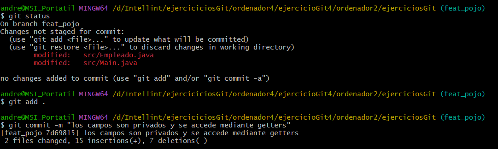
		
   ```bash
   git status
   git add .
   git commit -m "los campos son privados y se accede mediante getters"
   ```
   
  - Lo puseamos para que lo suba a remoto
   
   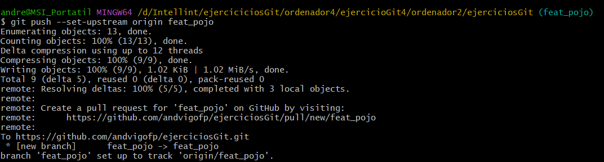
		
  ```bash
   git push --set-upstream origin feat_pojo o git push -u origin feat_pojo
  ```

 - ültimo nos cambiamos a la rama master, lo mergeamos y nos queda psusearlo
  
  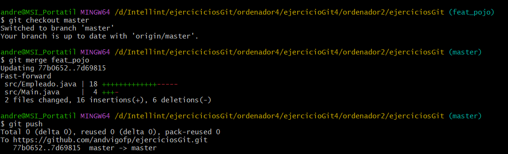
		
   ```bash
   git checkout master
   git merge feat_pojo
   git push
   ```
14. Realizamos otras mejoras en la rama **bug_deprecated_data_type** para solucionar los problemas de la librería obsoleta java.util.Date, y los mergeamos.
		
 1. Primer paso
 
 - Crear la rama bug_deprecated_data_type
  
  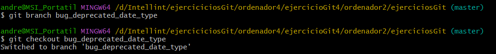
		
  ```bash
  git branch bug_deprecated_data_type o git checkout -b bug_deprecated_data_type
  git checkout bug_deprecated_data_type
  ```
  
  2. Segundo paso
  
  - Modificamos **Main.java** y lo comiteamos **mostrando los problemas de Date** 
   
   
			
  ```bash
  git status
  git add .
  git commit -m "migrado a LocalDate"
  ```
			
 - Nos queda subirlo a remoto la rama correspondiente
  
  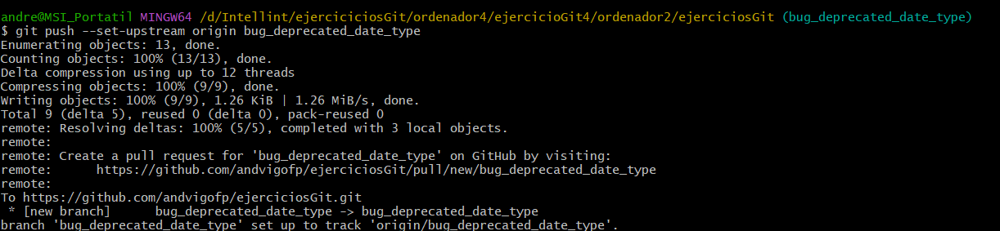
			
   ```bash
   git push --set-upstream origin bug_deprecated_data_type o git push -u origin bug_deprecated_data_type
   ```
   
 4. Cuarto paso

- Nos cambiamos a la rama master, lo mergeamos y lo puseamos
  
  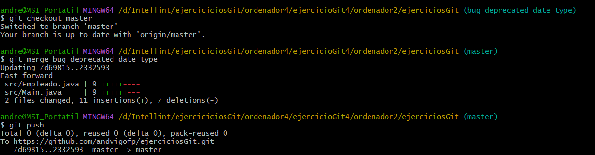
			
  ```bash
  git checkout master
  git merge bug_deprecated_data_type
  git push	
  ```
