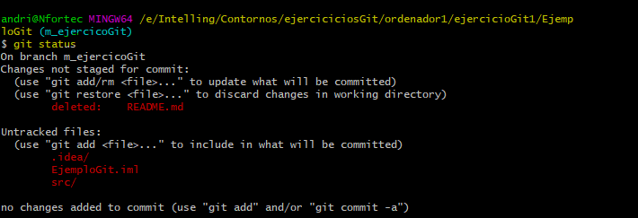
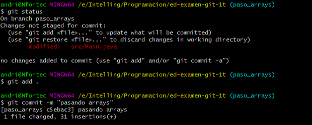

1. Creación de repositorio en GitHub, inicializándolo con un README.md y el .gitignore que
GiHub ofrece para Java.

2. Modificación de este README.md desde GitHub para indicar lo dos primeros pasos.

3. Clonando el repositorio remoto

4. Creo un proyecto en ese directorio con intellinj

5. Tercer commit 
# creando un proyecto ejercioGit2

6. ¡Ups! el proyecto se creó en una subcarpeta. Muevo su contenido al directorio raiz del
repo.
# Movemos el contendio de la subcarpeta al contendido al directorio raiz

7. Cuarto commit
# Moviendo el proyecto a la carpeta raiz del repo

8. Como quiero volver a antes de crear el proyecto, tengo que hacer un reset al commit previo (e4c0f7c). Al hacerlo, perdería los commits posteriores, así que creo una rama nueva para ello.
# Hacemos un git log --oneline apar ver el commit que quiero resear y volver al paso 3

9. Para crear una rama y pasar directamente a ella se podría también hacer en un paso con "git checkout -b rama2"
# Creamos la rama con git branch rama2 o git checkout -b rama2

10. Ahora se puede hacer reset:
# Hacemos reset al commit Update README.md

11. Crear el proyecto directamente en el directorio donde ya está el repo

12. Subiendo la rama2 y sus commit correspondiente

