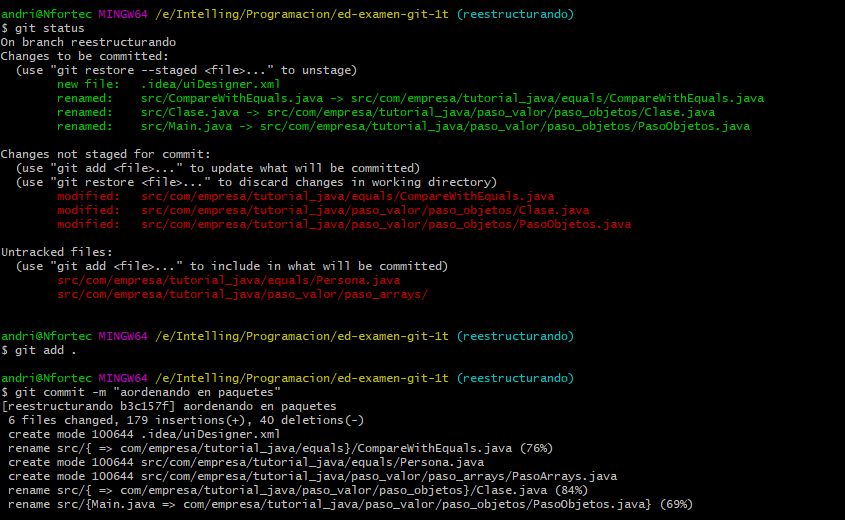
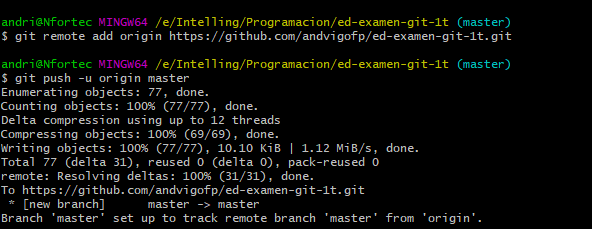

1. Creación de un proyecto en IntelliJ

2. primer commit
# Cremos un proyecto limpio en Intellij

3. segundo commit
# Ejecutamos el main y crea la carpeta .out

4. tercer commit
# creamos .gitignore, lo creamos con el comando "nano .gitignore" o cualquier editor

5. cuarto commit
# creamos el objeto Empleado y muestra objeto Empleado(Editando main) y ejecutmos Main.java

6 . quinto commit
# Elimanos el directorio .out con git rm -r out/

7 . sexto commit
# Añadimos el READMe.md y la carpeta img(con sus imágenes correspondientes)

8. septimo commit
# introducido problema a solucionar. Modificamos el Main.java(para solucionar el problema del Empleado)

9. octavo commit
# Ejecutamos Main.java para que se vuelva a crear el directorio .out para despúes solucionar el problema

10. noveno commit
# Modificamos .gitignore para corregir el problema del directorio .out(para que lo ignore)

11. decimo commit
# Modificamos Main.java, para hacer inmutable Empleado.nombre

12. once commit
# Elminamos el directorio .out "git rm -r out/"
# $ git status

13. doce commit
# Modificamos el Main.java y lo ejecutamos, ahora si ignora el directorio .out/
 