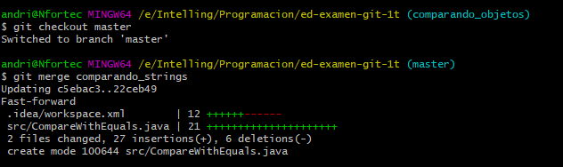
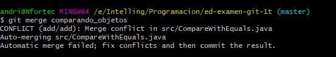
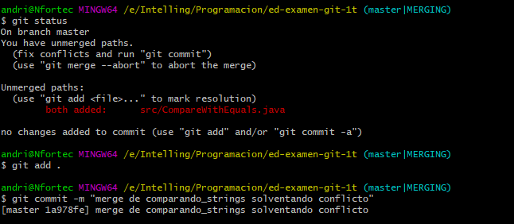

Andrés Fernández Pereira
Grupo: DAM

1. Creación de un proyecto de IntelliJ con repositorio Git y código de ejemplo.

	

2. Primer commit en master.

- Una vez creado el protecto comiteamos **proyecto base**

	

	```bash
	git status
	git add .
	git commit -m "proyecto base"
    ```

3. Creamos y desarrollamos la rama valor_referencia.

- Creamos la rama **valor_referencia** y nos cambias a esa rama correspondiente **valor_referencia**

	

	```bash
	git branch valor_referencia o git checkout -b valor_referencia
	git checkout valor_referencia
    ```
	
- Creamos el objecto Clase.java, lo desarrollamos y modificamos Main.java, por último lo comiteamos **probando paso por valor y referencia**
	
	 
	   
	 ```bash
	 git status
	 git add .
	 git commit -m "probando paso por valor y referencia"
     ```
	 
- Modifica objecto Clase y también modificamos Main.java, por último lo comiteamos **corregido y mejorado**	 
	 
	
	 
	  ```bash
	 git status
	 git add .
	 git commit -m "corregido y mejorado"
     ```

4. Hacemos un push de la rama valor_referencia.

 - Este paso no lo saltamos, **porque vamos a subir todas las ramas y su contenido a la vez**

5. Hacemos un merge de esta rama a master.

- Nos cambiamos a la rama master y despúes hacemos un merge **valor_referencia**
	
	
	
	 ```bash
	 git checkout master
	 git merge valor_referencia
     ```

6. Creamos una rama paso_arrays y la desarrollamos.

- Creamos la rama **paso_arrays** y nos cambiamos a la rama correspondiente **paso_arrays** 

	
	
	```bash
	 git checkout master
	 git merge valor_referencia
     ```
	
- Modificamos el Main.java y lo commiteamos **pasando arrays**

	
	
	```bash
	 git status
	 git add .
	 git commit -m "paso_arrays"
     ```
		
7. Hacemos un merge a master.

- Nos cambiamos a la rama master y hacemos un merge **paso_arrays** 

	
	
	```bash
	 git checkout master
	 git merge paso_arrays
     ```

8. Creamos las ramas comparando_objetos y comparando_strings y las desarrollamos.

- Creamos primero las dos ramas **comparando_objetos** y **comparando_strings**
	
	
	
	```bash
	 git branch comparando_objetos o git checkout -b comparando_objetos
	 git branch comparando_strings o git checkout -b comparando_strings
     ```
	 	 
- Nos cambiamos a la rama correspondiente **comparando_strings**

	
	
	```bash
	 git checkout comparando_strings
     ```
	
- Creamos el objecto **compareWithEquals.Java** y lo desarrollamos

	
	
	```bash
	 git status
	 git add .
	 git commit -m "probando equals con strings"
     ```
	
- Nos cambiamos a la rama **comparando_objetos**

	
		
	```bash
	 git checkout comparando_objetos
     ```

- Creamos el objecto **compareWithEquals.Java** y lo desarrollamos

	
	
	```bash
	 git status
	 git add .
	 git commit -m "ejemplos de uso de equals con objetos"
     ```

9. Hacemos merge de ambas a master, solventando el conflicto.

- Nos cambiamos a la rama master y mergeamos **comparando_strings**
- El primer merge no tendremos conflicto

	
	
	```bash
	 git checkout master
	 git merge comparando_strings
     ```
	 
- Ahora hacemos merge **comparando_objetos**, tenemos un conflicto
- Porque comparando_strings y comparando_objetos, tienen el mismo archivo y diferente contendio

	
	
	```bash
	 git merge comparando_objetos
     ```
	 
- Lo solucionamos cambiando el contenido y lo comiteamos **merge de comparando_strings solventando conflicto**

	 
	 
	 ```bash
	 git status
	 git add .
	 git commit -m "merge de comparando_strings solventando conflicto"
     ```
	 
10. Creamos la rama "reestructurando" para reorganizar en paquetes. Una vez desarrollada hacemos merge a master
(es recomendable ver el estado de los ficheros de este commit, más que el diff).

- Creamos la rama **reestructurando** y nos cambiamos a la rama correspondiente **reestructurando**

	
	
	```bash
	 git branch reestructurando o git checkout -b reestructurando
	 git checkout reestructurando
     ```

- Creamos los paquetes necesarios y creamos los objetos .java y el resto de archivos.java, lo metemos en su paquete correspondiente
- Modificamos compareWithEquals.Java, Main.Java y lo cambiamos al nombre del objeto correspondiente **PasoObjetos**
- Una vez echo todo los cambiamos lo comiteamos **aordenando en paquetes**
	
	
	
	```bash
	 git status
	 git add .
	 git commit -m "aordenando en paquetes"
     ```

- Nos cambiamos a la rama master y lo mergeamos **reestructurando**

	
	
	```bash
	 git checkout master
	 git merge reestructurando
     ```
	
11. Realizamos una corrección menor en valor_referencia y la hacemos un merge a master.

- Nos cambiamos a la rama valor_referencia
- Modificamos el ojeto Clase,java y lo comiteamos **corrección menor: escape de comilla**

	
	
		```bash
	 git checkout valor_referencia
	 git status
	 git add .
	 git commit -m "corrección menor: escape de comilla"
     ```
	 

- Nos cambiamos a la rama master y mergeamos **valor_referencia**
	
	
	
	```bash
	 git checkout master
	 git merge valor_referencia
     ```
- Nos dara un conflicto por objeto Clase.Java, lo que hacemos es añadirlo y commitearlo **Merge branch 'valor_referencia'**

	
	
	```bash
	 git status
	 git add .
	 git commit -m "Merge branch 'valor_referencia'"
     ```
	 
- ültimos nos queda subir la rama master y todo su contenido

	
	
	```bash
	 git remote add origin https://github.com/andvigofp/ed-examen-git-1t.git
	 git push -u origin master
     ```

- Subir todas las ramas a la vez y su contendio

	

	 ```bash
	 git pull --all https://github.com/andvigofp/ed-examen-git-1t.git
     ```