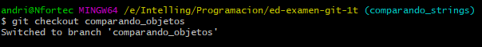

1. Creación de un proyecto en IntelliJ

2. primer commit
# Cremos un proyecto limpio en Intellij

3. segundo commit
# Ejecutamos el main y crea la carpeta .out

4. tercer commit
# creamos .gitignore nano .gitignore o cualquier editor

5. cuarto commit
# creamos el objeto Empleado y muestra objeto Empleado(Editando main) y ejecutmos Main.java

6 . quinto commit
# Elimanos la carpeta .out git rm -r out/

