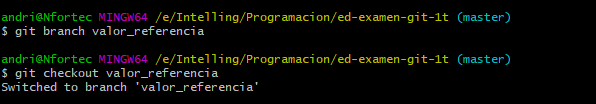
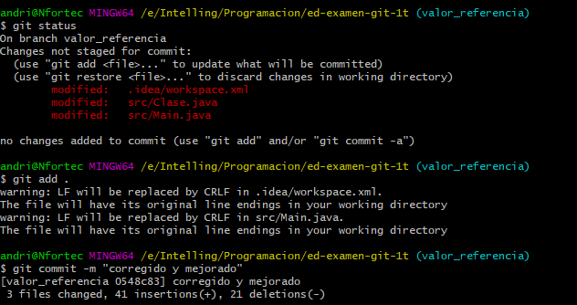
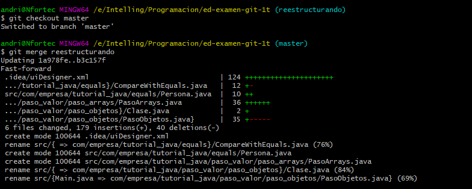

1. Creación de un proyecto en IntelliJ


2. primer commit

- Creamos un proyecto limpio en Intellij


  
  ```bash
  git init
  ```
  
- Creamos una rama m_ejercicioGit
      


  ```bash
 git checkout -b m_ejercicioGit o git branch m_ejercicioGit
 ```
  

    
 ```bash
 git status
 ```
 
 - Añadimos el commit **creo un proyecto limpico con IntelliJ**
     

  
  ```bash
  git add .
  git commit -m "creo un proyecto limpico con IntelliJ"
  ```
  
3. segundo commit

- Ejecutamos el main y crea la carpeta .out


 ```bash
 git status
 git add .
 git commit -m "acabo de ejecutar el main"
 ```
 
4. tercer commit

- creamos .gitignore, lo creamos con el comando "nano .gitignore" o cualquier editor
- Lo podemos crear el .gitignore, por editor por ejemplo **nano .gitignore**


 ```bash
 nano .gitignore, notepadd++ .gitignore o code .gitignore
 ```
 
- Le añadimos .out y lo guardamos **Ctrl izquierdo + o**


 ```bash
 Ctrl izquiedo + o  para guardar y Ctrl izquierdo + x para salir 
 ```
 
 - Nos queda commitear **añadido gitignore**     


```bash
 git status
 git add .
 git commit -m "añadido gitignore"
 ```

5. cuarto commit

- creamos el objeto Empleado y muestra objeto Empleado(Editando main) y ejecutmos Main.java


  
  ```bash
  git status
  git add .
  git commit -m "programa que crea y muestra un objeto empleado"
  ```
  
6 . quinto commit

- Eliminanms el directorio .out con **git rm -r out/**


  
  ```bash
  git rm -r out/
  ```
  
  - ültimo nos queda commitear  **eliminando directorio out**  


  
 ```bash
 git status
 git add .
 git commit -m "eliminando directorio out"
 ```
  
7 . sexto commit

- Añadimos el READMe.md y la carpeta img(con sus imágenes correspondientes)


  
```bash
git status
```

 - Último nos queda commitear     


 
 ```bash
 git add .
 git commit -m "añadido el README"
 ```

8. septimo commit

- introducido problema a solucionar. Modificamos el Main.java(para solucionar el problema del Empleado)


```bash
git status
git add .
git commit -m "introducido problema a solucionar"
```

9. octavo commit

- Ejecutamos Main.java para que se vuelva a crear el directorio .out para despúes solucionar el problema


  
```bash
git status
git add .
git commit -m "vuelvo a subir out para corregir luego el .gitignore y comprobar su f…"
```
     
   
10. noveno commit

- Modificamos .gitignore para corregir el problema del directorio .out(para que lo ignore)
- Editamos .gitignore **nano gitignore**
- Cambiamos .out por out/


```bash
nano .gitignore Ctrl izquierdo + o para guardar y Ctrl izquierdo + x para salir
```

- Nos queda commitear **corregido .gitignore para ignorar carpeta out**



```bash
git status
git add .
git commit -m "corregido .gitignore para ignorar carpeta out"
```

11. decimo commit

- Modificamos Main.java, para hacer inmutable Empleado.nombre
- Nos queda commitear **Haciendo inmutable el campo Empleado.nombre**


  
```bash
git status
git add .
git commit -m "Haciendo inmutable el campo Empleado.nombre"
```

12. once commit

- Elminamos el directorio .out "git rm -r out/"


  
```bash
git rm -r out/
```

 - Último nos queda commitear **elimino carpeta out**     


    
```bash
git status
git add .
git commit -m "elimino carpeta out"
```

13. doce commit

- Modificamos el Main.java y lo ejecutamos, ahora si ignora el directorio .out/
- Por último nos queda commitear **ahora ssí ignora correctamente out**

 
  
```bash
git status
git add .
git commit -m "ahora ssí ignora correctamente out"
```
  
