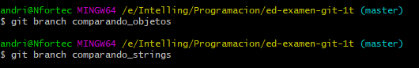
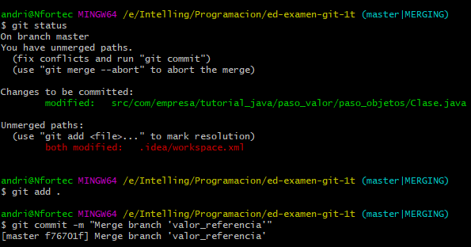
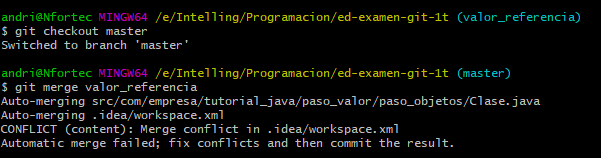

1. Creamos un repositorio nuevo en github con un README y un .gitignore


2. Creamos un proyecto nuevo marcando la opción "Create Git repository"


3. Hacemos un git status, para ver si hubo cambios


```bash
git rm --cached .idea/workspace.xml
```

4. Añadimos el repo de github como remoto e intentamos hacer un pull (recordemos que lo hemos creado con un README y un .gitignore)


```bash
git pull origin m_ejercicioGit3
```

- No podemos hacer un pull por tener cambios en stage local que no hemos commiteado (los
ficheros del proyecto local). Al crear el proyecto marcando la opción "Create Git repository",
se ha hecho un git init y, aparentemente, se han añadido al stage (se ha hecho un git add) pero
no hemos hecho un commit.

- Lo añadimos y borramos la cahed de lo que añadimos 


```bash
git add. 
git rm --cached r .
```

5. Ahora los cambios están sin trackear. Intentamos de nuevo hacer un pull.

- Al haber creado un .gitignore en remoto y otro en local, hay un conflicto entre estos ficheros


```bash
git pull origin m_ejercicioGit3
```

6. Podemos eliminar el .gitignore local si queremos quedarnos con el remoto:


```bash
git rm -r .gitignore
```

7. Ya tenemos descargado lo que estaba en remoto (el README y el .gitignore de GitHub) en
la rama main (rama por defecto en GitHub) a nuestra rama master local.

-  Ahora commiteamos el proyecto local y lo subimos al repositorio.


```bash
git status
git add .
git commit -m "mi primer commit local"
```

- Ahora nos toca subir remoto la rama master



```bash
git remote add origin https://github.com/andvigofp/ejerciciosGit.git
git push -u origin master
```

- Observamos que se ha subido correctamente pero en la rama master (que era en la que
estábamos trabajando en local), mientras que la rama main se mantiene con su primer
commit.


8. Eliminamos la rama main en el repositorio de GitHub

- Primero tenemos que poner la rama master por defecto


- Ahora podemos eleminar la rama m_ejercicioGit3(Simulo la rama main)


- Otra forma de borrar la rama 
- 
```bash
git pull origin --delete m_ejercicioGit3
```

9. Modificamos el proyecto local (commit: "añadiendo código para probar las propiedades de Java")

- Añadimos objeto Empleado y modificamos Main, lo ejecutamos para probar


```bash
git status
git add .
git commit -m "añadiendo código para probar las propiedades de Java"
```

- Nos queda pusear


```bash
git push
```

10. Creamos una nueva rama para corregir un bug:
[INTENTAD ARREGLARLO POR VOSOTROS MISMOS]:
Las especificaciones de nuestro programa nos impiden que una persona cambie de nombre.

- Creamos la rama fixBug1 con **git checkout -b fixBug1** o **git branch fixBug1**


```bash
git branch fixBug1 o git checkout -b fixBug1
git checkout -b fixBug1
```

- git checkout sirve para cambiar de commit (en este caso de rama, una rama es un identificador 
- que apunta a un determinado commit --que es el último de su rama--'). La opción -b crea una rama nueva (no podríamos hacer checkout a una rama que no existe).

11. Corregimos este problem, commiteamos la corrección en la rama y la pusheamos.

- Modificamos Empleado.java y Main.java, para arreglar el bug del nombre del empleado


```bash
git status
git add .
git commit -m "bug corregido y testeado"
```

- Por ultimo lo puseamos para subir la rama fixBug1


```bash
git push -u origin fixBug1 "
```

12. Mergeamos a master la rama con el bug ya solucionado

- Primero nos cambiamos a la rama master "git checkout master"



```bash
git checkout master
```

- Ahora podemos mergear sin problema 



```bash
git merge fixBug1
git push
```
