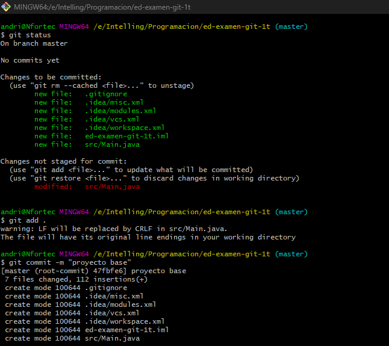

1. Creación de repositorio en GitHub, inicializándolo con un README.md y el .gitignore que
GiHub ofrece para Java.



2. Modificación de este README.md desde GitHub para indicar lo dos primeros pasos.


3. Clonando el repositorio remoto


 ```bash
 git clone https://github.com/andvigofp/ejerciciosGit.git
 ```

4. Creo un proyecto en ese directorio con intellinj


5. Tercer commit 

- Nos queda commitear **creando proyecto en intellij**


```bash
 git status
 git add .
 git commit -m "creando proyecto en intellij"
 ```

6. ¡Ups! el proyecto se creó en una subcarpeta. Muevo su contenido al directorio raiz del
repo.

- Movemos el contendio de la subcarpeta al contendido al directorio raiz


7. Cuarto commit

- Por último nos queda commitear


```bash
 git status
 git add .
 git commit -m "moviendo el proyecto a la carpeta raiz del repo"
 ```
