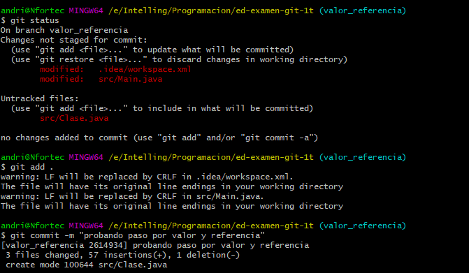

1. Creación de repositorio en GitHub, inicializándolo con un README.md y el .gitignore que
GiHub ofrece para Java.


2. Modificación de este README.md desde GitHub para indicar lo dos primeros pasos.


3. Clonando el repositorio remoto



 ```bash
 git clone https://github.com/andvigofp/ejerciciosGit.git
 ```

4. Creo un proyecto en ese directorio con intellinj


2. Primer commit 

- Nos queda commitear **creando proyecto en intellij**


 ```bash
 git status
 git add .
 git commit -m "creando proyecto en intellij"
 ```

6. ¡Ups! el proyecto se creó en una subcarpeta. Muevo su contenido al directorio raiz del
repo.

- Movemos el contendio de la subcarpeta al contendido al directorio raiz


7. Segundo commit

- Por último nos queda commitear moviendo el **proyecto a la carpeta raiz del repo**


```bash
 git status
 git add .
 git commit -m "moviendo el proyecto a la carpeta raiz del repo"
 ```
 - Nos queda subir a remoto
 
```bash
 git remote add origin https://github.com/andvigofp/ejerciciosGit.git
 git push -u origin master
 ```

8. Como quiero volver a antes de crear el proyecto, tengo que hacer un reset al commit previo (e4c0f7c). Al hacerlo, perdería los commits posteriores, así que creo una rama nueva para ello.

- Hacemos un git log --oneline apar ver el commit que quiero resear y volver al paso 3


- Nos queda subir a remoto

```bash
 git log --oneline
 ```

9. Para crear una rama y pasar directamente a ella se podría también hacer en un paso con "git checkout -b rama2"

- Creamos la rama con **git branch rama2** o **git checkout -b rama2**


```bash
 git branch rama2 o git checkout -b rama2
 git checkout rama2
 ```

10. Ahora se puede hacer reset:

- Hacemos reset al commit Update README.md


```bash
 git reset --hard e4c0
 ```

11. Crear el proyecto directamente en el directorio donde ya está el repo


12. Subiendo la rama2 y sus commit correspondiente

- Nos queda commitear **creando proyecto directamente en repo clonado en rama2**
 


```bash
git status
git add .
git commit -m "creando proyecto directamente en repo clonado en rama2"
 ```

- Último nos queda pusear


```bash
git push -u origin rama2 o git push --set-upstream origin bug_edad_negativa
 ```
